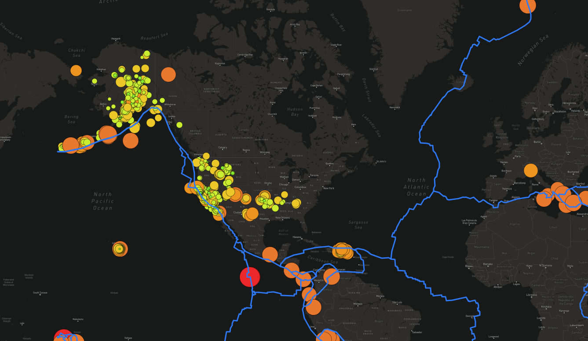

# Mapping_Earthquakes

## Background and purpose
Building upon previous maps, this purpose of this exercise was to build more layers starting with a tetonic map overlay. This helps illustrate the location of the plates in relation to earthquakes. First we started with all size earthquakes is the last seven days. Then the code was changed so that earthquakes greater than a 4.5 magnitude is illustrated. Infomation that is in the following map not only includes information such as earthquakes and tetonic plates but va isual practice on making the map more pleasing to the viewer such as satellite and dark mode. Using the knowledge learned about Javascript, Leaflet.js, and geoJSON data, the following map was created:

